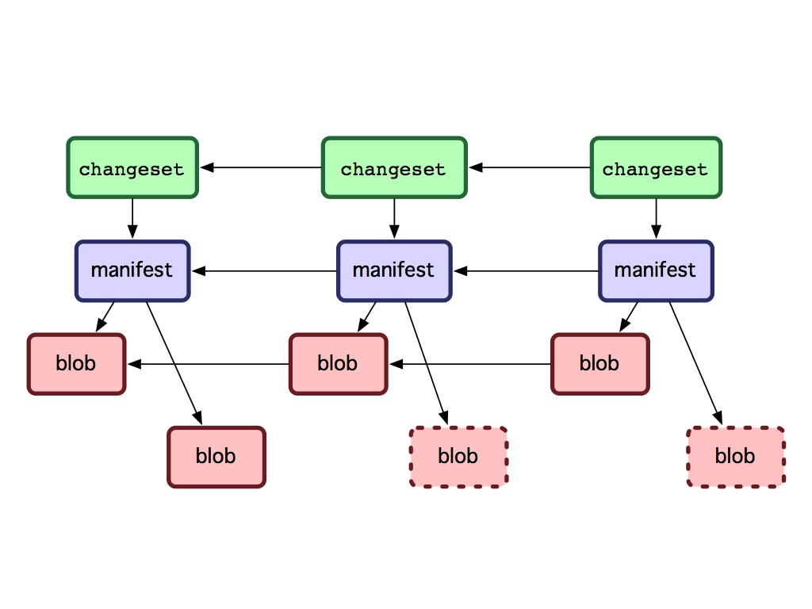
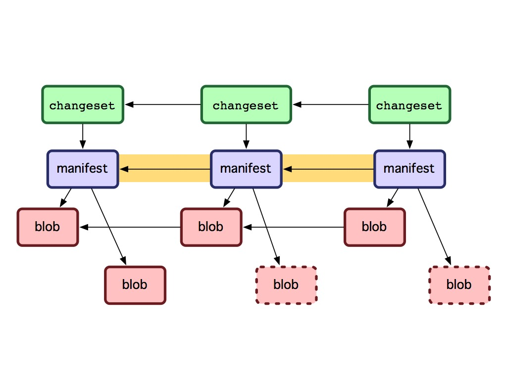
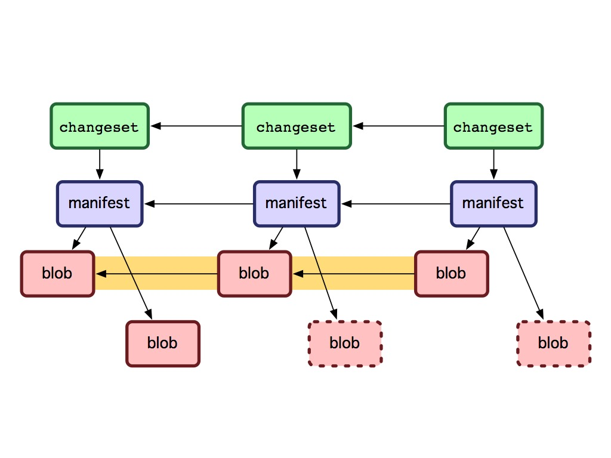
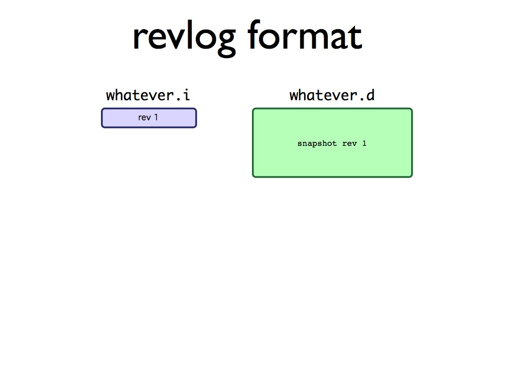
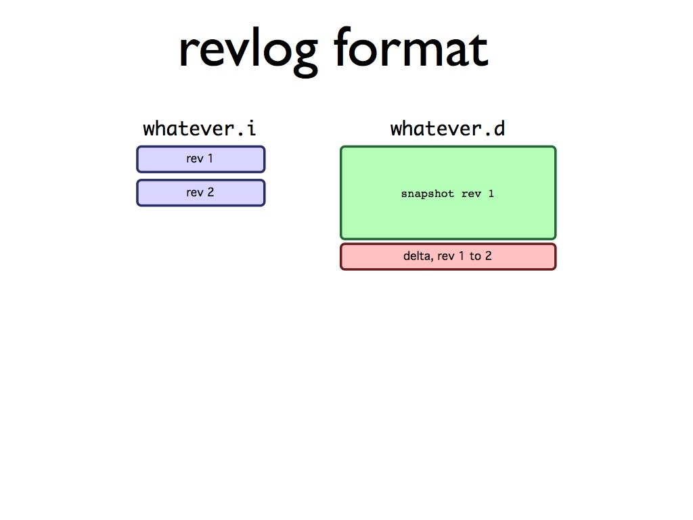
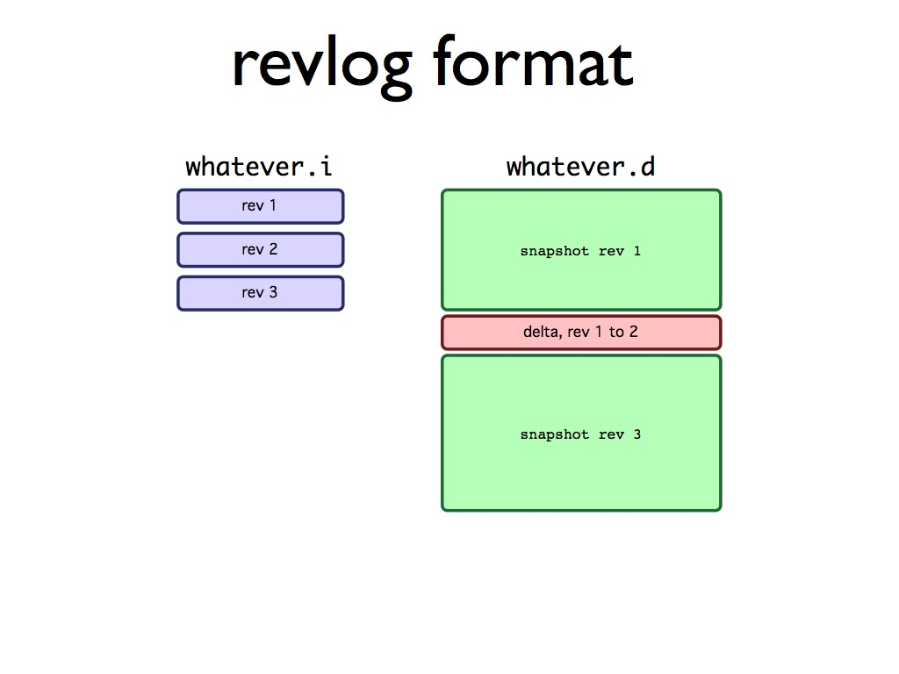
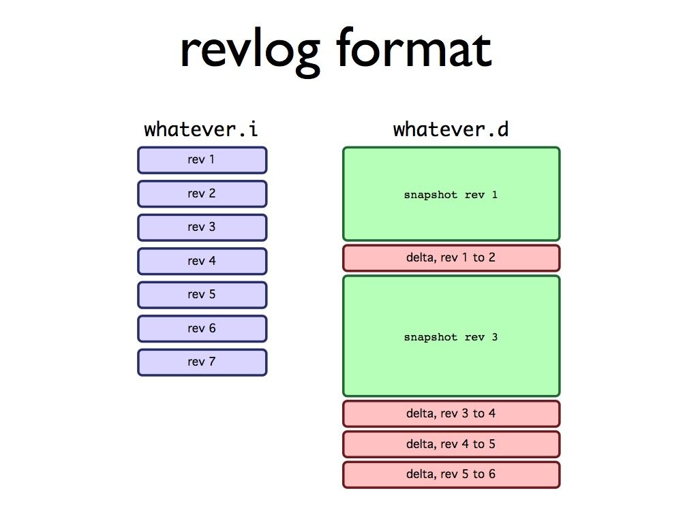
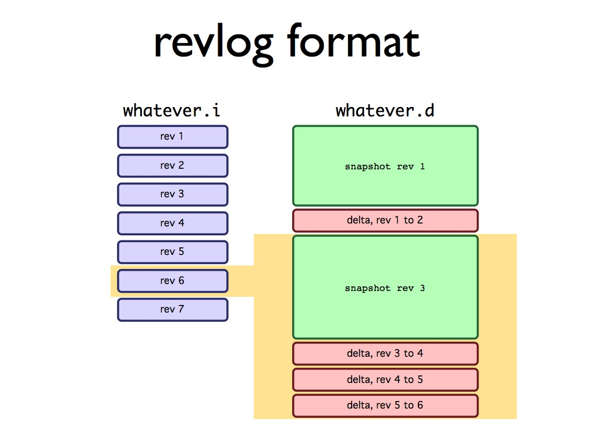
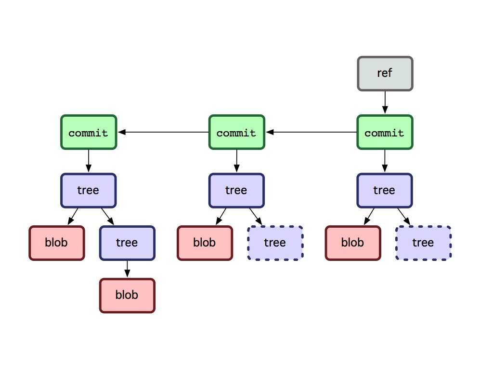

!SLIDE

# storage methodologies #

!SLIDE

## revlog vs associative storage ##

!SLIDE

# revlog - hg #

!SLIDE

!SLIDE

!SLIDE

!SLIDE

!SLIDE

!SLIDE

!SLIDE

!SLIDE

!SLIDE

!SLIDE

# associative storage - git #

!SLIDE

!SLIDE commandline incremental

	$ git log
	commit 431dce0e45134067849647ec3cc5bf60e5da310e
	Author: Scott Chacon <schacon@gmail.com>
	Date:   Sun Feb 21 09:53:28 2010 -0500

	    almost time for the talk, better step it up

	commit 9c683fa91af47c74abc5493fd70bf560871c5245
	Author: Scott Chacon <schacon@gmail.com>
	Date:   Sat Feb 20 17:22:47 2010 -0500

	    outline

	$ git cat-file -p 431dce0e45134067849647ec3cc5bf60e5da310e
	tree 2f2fa51bd3fe23de756776a298d15b3c557e7363
	parent 9c683fa91af47c74abc5493fd70bf560871c5245
	author Scott Chacon <schacon@gmail.com> 1266764008 -0500
	committer Scott Chacon <schacon@gmail.com> 1266764008 -0500

	almost time for the talk, better step it up

!SLIDE commandline incremental

	$ git cat-file -p 2f2fa51bd3fe23de756776a298d15b3c557e7363
	040000 tree 8493862ea0e5da9db1e26e59e58fa70d4f0ad2d5	about_me
	040000 tree d1c2ce02dbb8be10f9dc2d576ad33c5607208f34	difference
	040000 tree 03acd8d3163804fbd2d4fedbd3d5c65c956fba69	future
	040000 tree 790bc18c9f5284b7ceca2851f0c909ac8e51e57f	hg-git
	040000 tree c9a26a4070e782e989c6d908b9005423b24ae93f	hg_git_birth
	100644 blob 34c0dedd2d0f826dce1256f062f709894b00636a	notes.txt
	040000 tree 322172d5255de6effc273ebc057913df710c7368	plugins
	100644 blob a32aeeac35a5368e0d726c5ebe8a3faf07f4657c	showoff.json
	040000 tree 318e066c80cbacf80851d34b87c522ece52a8115	similar
	040000 tree 63b4d3babf6ccea797053a468a98dbb5cfdbc629	title
	040000 tree 3529afe0bda3aae78d8f67608e7b6f2b71e38c25	why_care

!SLIDE commandline incremental

	$ git cat-file -p a32aeeac35a5368e0d726c5ebe8a3faf07f4657c
	[ 
	 {"section":"title"},
	 {"section":"about_me"},
	 {"section":"why_care"},
	 {"section":"hg_git_birth"},
	 {"section":"similar"},
	 {"section":"difference"},
	 {"section":"plugins"},
	 {"section":"hg-git"},
	 {"section":"future"}
	]

!SLIDE

