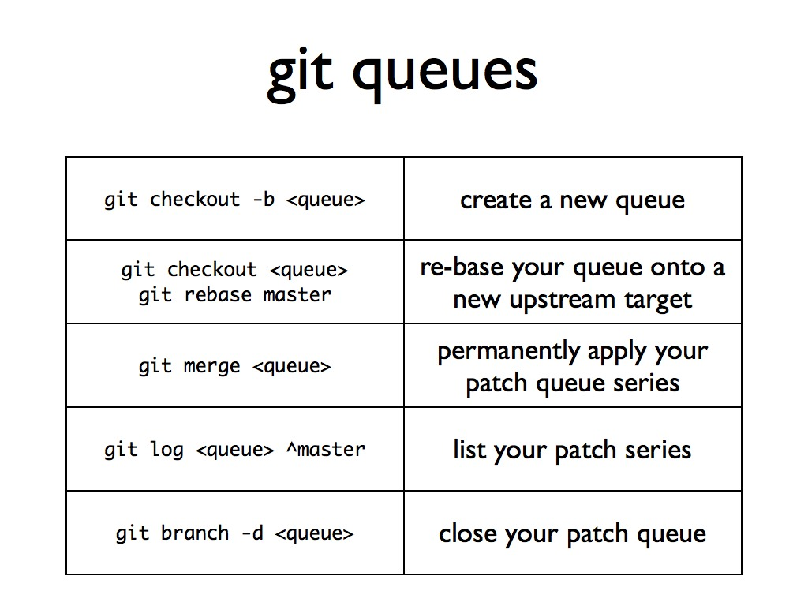

!SLIDE

# patch management #

!SLIDE

## mq vs topic branches ##

!SLIDE code

# ~/.hgrc #

	[extensions]
	hgext.mq = 

!SLIDE small

# hg help mq #

	prepare repository to work with patches   qinit
	create new patch                          qnew
	import existing patch                     qimport

	print patch series                        qseries
	print applied patches                     qapplied
	print name of top applied patch           qtop

	add known patch to applied stack          qpush
	remove patch from applied stack           qpop
	refresh contents of top applied patch     qrefresh
	
!SLIDE

