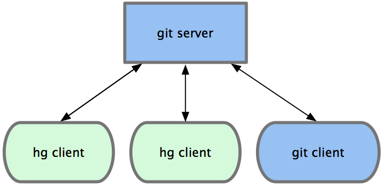

!SLIDE

# The Hg-Git Plugin #

!SLIDE center

# hg-git.github.com #

!SLIDE center

!SLIDE

# installing #

!SLIDE code

# easy_install hg-git #

!SLIDE code

# ~/.hgrc #

	[extensions]
	hgext.bookmarks =
	hggit =

!SLIDE commandline incremental

	$ hg clone git://github.com/schacon/pycon-hg-git.git
	destination directory: pycon-hg-git.git
	importing Hg objects into Git
	Counting objects: 70, done.
	Compressing objects: 100% (56/56), done.
	Total 70 (delta 15), reused 0 (delta 0)
	importing Git objects into Hg
	at: 0/5
	updating to branch default
	41 files updated, 0 files merged, 0 files removed, 0 files unresolved

	$ cd pycon-hg-git.git/

	$ hg head
	changeset:   4:e6c1e4119b29
	tag:         master
	tag:         default/master
	tag:         tip
	user:        Scott Chacon <schacon@gmail.com>
	date:        Sun Feb 21 10:53:36 2010 -0500
	summary:     added initial readme

!SLIDE commandline incremental

	$ cd .hg

	$ ls git*
	git-mapfile  git-tags

	git:
	HEAD        description  info      refs
	branches    hooks        objects

	$ head git-mapfile 
	431dce0e45134067849647ec3cc5bf60e5da310e 897637404c5c4b98639d65f619a00268016d9270
	37d23a5b704a4aea0d570dc9c72d53d073cbeceb 8bd14eaefc76fbfd1149b7f89ef7384d188790ad
	9c683fa91af47c74abc5493fd70bf560871c5245 ad636bcc1a56d00dd64993e064fba0981615e024
	2745cf4986060d6226dc4826c94baddc42fdbe03 b30df96fe4b492690124f998dd70a4974a8ba868
	be5c8d26d7a2a45dd9e3b808749eb1f455d0ccbd e6c1e4119b29d3b376edd50ff18920bf0df6a0ee

!SLIDE code small

## \_\_init.py\_\_ ##

	@@@ python
	hg.schemes['git'] = gitrepo
	hg.schemes['git+ssh'] = gitrepo

	def reposetup(ui, repo):
	    klass = hgrepo.generate_repo_subclass(repo.__class__)
	    repo.__class__ = klass

## hgrepo.py ##

	@@@ python
	def generate_repo_subclass(baseclass):
	    class hgrepo(baseclass):
	        def pull(self, remote, heads=None, force=False):
	            if isinstance(remote, gitrepo):
	                git = GitHandler(self, self.ui)
	                git.fetch(remote.path, heads)
	            else: #pragma: no cover
	                return super(hgrepo, self).pull(remote, heads, force)

!SLIDE

# bidirectionality #

!SLIDE small

	commit 2d1a527b2489c9d10e98bcfa14ee52ca4f731db4
	Author: Augie Fackler <durin42@gmail.com>
	Date:   Tue Oct 27 22:39:45 2009 -0400

	    tests: inline unit tests into main test suite
    
	    --HG--
	    rename : unit-tests/topo-test.py => tests/test-topo-sort.py
	    rename : unit-tests/url-test.py => tests/test-url-parsing.py

!SLIDE small

	commit 8247160cc0d809ab059ee4ce7f4518a7e90b0324
	Author: Sverre Rabbelier <srabbelier@google.com>
	Date:   Fri Jul 31 15:27:20 2009 -0700

	    switch object mapping to hg->git since the many to one is that direction

	    --HG--
	    extra : transplant_source : %92%D2%D0%B3%19%5E%FCK%5E%B5%3A%2B%9Cy%B7%0F%D7%2Bm%D5

!SLIDE

# salt lake city merges #

!SLIDE

# issues with bidirectionally #

!SLIDE

	@@@ python
    if len(ctx.files()) > 0:
        for filenm in ctx.files():
            extra_message += "files : " + filenm + "\n"
