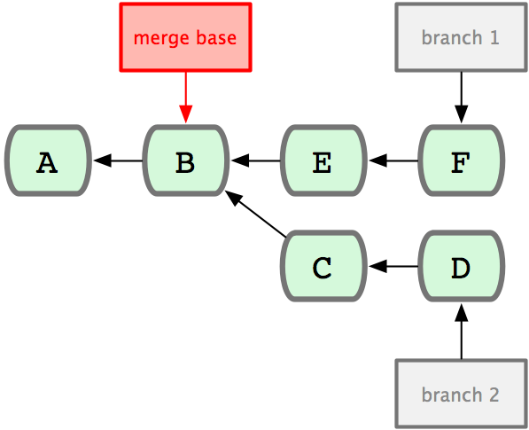

!SLIDE

# The Similarities #

!SLIDE

# 1. Fully Local Repositories #

!SLIDE code

# $ hg init #

# $ git init #

!SLIDE bullets incremental

# What does fully local mean? #

* everything is freaking fast
* every clone is a backup
* working offline

!SLIDE

# 2. Directed Graph Histories #

!SLIDE

# merges are hugely easier #

!SLIDE center

!SLIDE

# 3. SHA1 Content Checksumming #

!SLIDE commandline

	$ git log --oneline
	1dcd6e8 for pj
	ad8c045 no neccesito el nokogiri, mofo
	e6b93f8 Merge remote branch 'origin/master' into locale
	5ae5032 Resque 1.1.0 => 1.4.0
	eabdf5a "View on your Fork Queue"
	1fef2dc short sha on pull request show page too, also unlink "you"
	ad2bc5c add user's login as id to fq so we can have anchors
	565c03b add the version number onto the resque plugin
	04d80f3 i18n the rest of the basic events i can easily do
	cc10266 i18n comment event
	d8ce6d2 i18n commit event
	c707df5 i18n create event
	665b6fd i18n welcome event and new repo page
	23c7a84 Merge remote branch 'origin/master' into locale
	75b8035 Unique repositories in trending only please
	7371c81 Kill extra space on octofication
	0793e7c use i18n
	a795ea0 can't forget the tests

!SLIDE commandline

	$ hg debugindex .hg/store/00changelog.i 
	   rev    offset  length   base linkrev nodeid       p1           p2
	     0         0    2151      0       0 fb786086bc9e 000000000000 000000000000
	     1      2151     122      1       1 39362f0c2365 fb786086bc9e 000000000000
	     2      2273     218      1       2 4d311eda0a36 fb786086bc9e 000000000000
	     3      2491      97      3       3 235eb2ed5223 4d311eda0a36 39362f0c2365
	     4      2588     178      3       4 051c59d713ca 235eb2ed5223 000000000000
	     5      2766     272      3       5 3bc69577dd4e 051c59d713ca 000000000000
	     6      3038     191      6       6 91925f1519fb 3bc69577dd4e 000000000000
	     7      3229     812      6       7 f53f0a0fc298 91925f1519fb 000000000000
	     8      4041     176      8       8 1dd63eec5124 f53f0a0fc298 000000000000
	     9      4217     116      9       9 b58bb8e0490d 1dd63eec5124 000000000000
	    10      4333     134      9      10 4facaa78e29c b58bb8e0490d 000000000000
	    11      4467     224      9      11 1e8136ad88a9 f53f0a0fc298 000000000000
	    12      4691     130     12      12 f52880ec4842 1e8136ad88a9 000000000000
	    13      4821     152     12      13 cc4d29bb6689 f52880ec4842 b58bb8e0490d
	    14      4973     103     14      14 368bd26edca7 cc4d29bb6689 4facaa78e29c
	    15      5076     290     14      15 b5856496eef9 368bd26edca7 000000000000
	    16      5366     196     16      16 582a2fb80336 368bd26edca7 000000000000
	    17      5562     140     16      17 428dce3d95f5 b5856496eef9 582a2fb80336
	    18      5702     171     18      18 ee55668a698a 428dce3d95f5 000000000000
	    19      5873     189     18      19 e5fee4a3a498 428dce3d95f5 000000000000

!SLIDE

# 4. Blinding Speed #

!SLIDE

## not implicit by being local ##

!SLIDE

## see bzr 1.x, darcs, arch for counterexamples ##

!SLIDE bullets incremental

# To Summarize #

* Local Repositories
* Directed Graph History
* SHA1 Content Checksumming
* Speed

!SLIDE

# these are important #

!SLIDE

# if you know one, you largely know the other #

!SLIDE commandline

	$ hg
	Mercurial Distributed SCM

	basic commands:

	 add        add the specified files on the next commit
	 annotate   show changeset information by line for each file
	 clone      make a copy of an existing repository
	 commit     commit the specified files or all outstanding changes
	 diff       diff repository (or selected files)
	 export     dump the header and diffs for one or more changesets
	 forget     forget the specified files on the next commit
	 init       create a new repository in the given directory
	 log        show revision history of entire repository or files
	 merge      merge working directory with another revision
	 pull       pull changes from the specified source
	 push       push changes to the specified destination
	 remove     remove the specified files on the next commit
	 serve      export the repository via HTTP
	 status     show changed files in the working directory
	 summary    summarize working directory state
	 update     update working directory

!SLIDE commandline

	$ git

	The most commonly used git commands are:
	   add        Add file contents to the index
	   bisect     Find by binary search the change that introduced a bug
	   branch     List, create, or delete branches
	   checkout   Checkout a branch or paths to the working tree
	   clone      Clone a repository into a new directory
	   commit     Record changes to the repository
	   diff       Show changes between commits, commit and working tree, etc
	   fetch      Download objects and refs from another repository
	   grep       Print lines matching a pattern
	   init       Create an empty git repository or reinitialize an existing one
	   log        Show commit logs
	   merge      Join two or more development histories together
	   mv         Move or rename a file, a directory, or a symlink
	   pull       Fetch from and merge with another repository or a local branch
	   push       Update remote refs along with associated objects
	   rebase     Forward-port local commits to the updated upstream head
	   reset      Reset current HEAD to the specified state
	   rm         Remove files from the working tree and from the index
	   show       Show various types of objects
	   status     Show the working tree status
	   tag        Create, list, delete or verify a tag object signed with GPG

!SLIDE

# our enemy is SVN #
